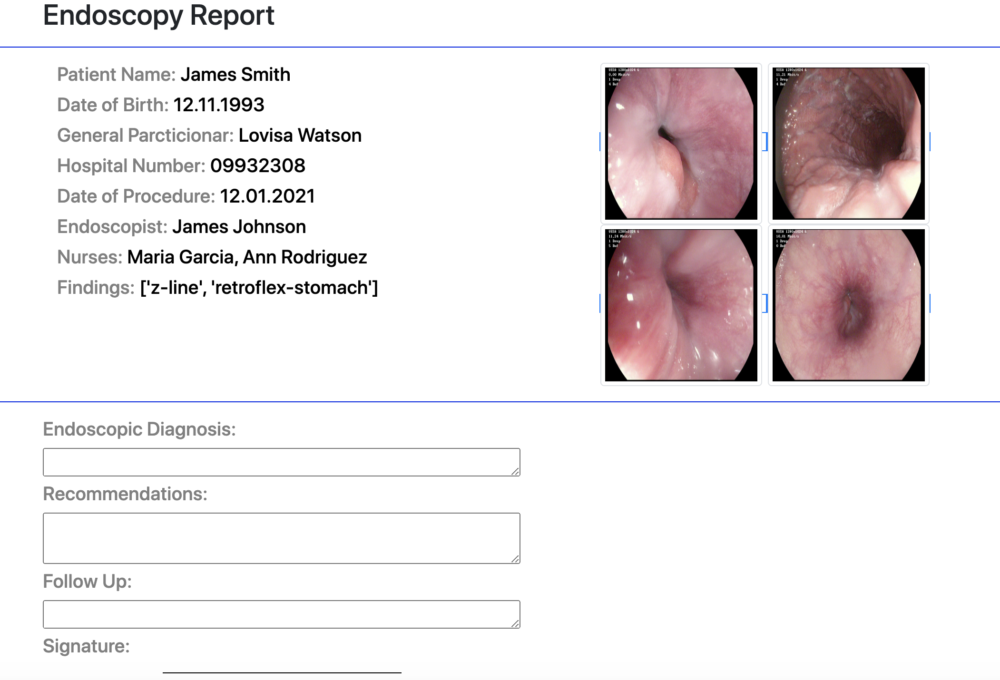

# Disease_Prediction_in_Gastrointestinal_tract_using_Endoscopy_videos

KvasirClassifier - Deployment

  

• This repository consists of files required to deploy a Deep Learning Web App created with Flask on Heroku platform.

• If you want to view the deployed model, click on the following link:
Deployed at: https://endoscopyreport.herokuapp.com/

• If you are searching for Code, Algorithms used and Accuracy of the model.. you won't find it here. Click the link mentioned below for the same:
Link: https://github.com/matrikasubedi/Disease_Prediction_in_Gastrointestinal_tract_using_Endoscopy_videos

• Please do ⭐ the repository, if it helped you in anyway.

• A glimpse of the web app:

